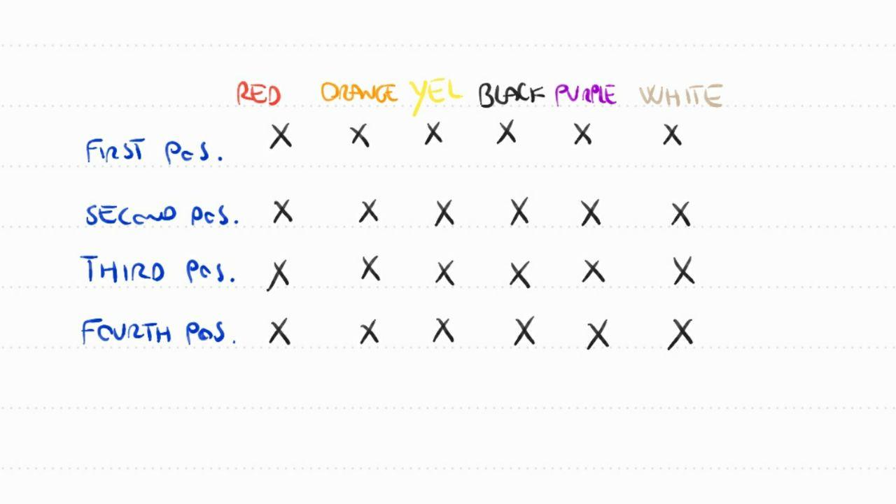

# Mastermind

My program in python to solve mastermind game.

### **My idea to solve the problem:**

To use a matrix where in a position (x,y) where x stands for straights and y for columns.

X corresponds to the position in the sequence

Y corresponds to the selected colour

In this way we could update the value of probability for all couple (position, colour).

